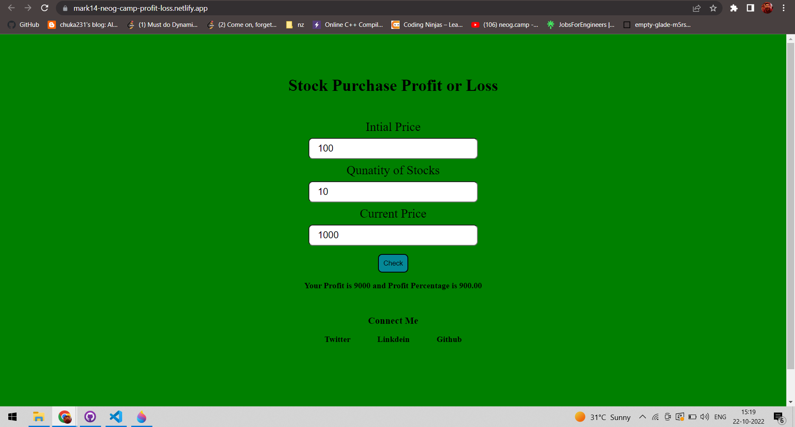

# Mark-14- NeogCamp- Stock profit loss
## About: 
- The app Takes input stock price for one stock as input from user.
- App takes current stock price for one stock as input from user.
- Takes quantity of stocks purchased.
- The app calculates profit/loss in values and percentage.
- Live link to the project is [here](https://mark14-neog-camp-profit-loss.netlify.app/).

## Tech stack used:
1. HTML
2. CSS
3. JavaScript
4. Netlify(for deployment)

